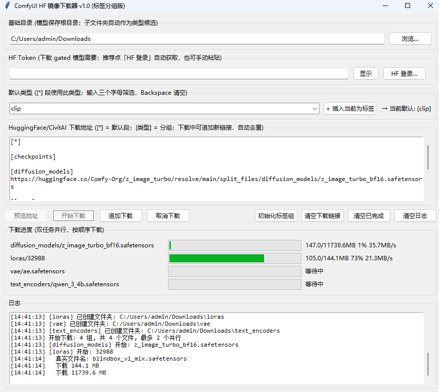

# ComfyUI HF Mirror Download

专为 ComfyUI 用户设计的模型下载工具：HuggingFace 链接自动转换为 `hf-mirror.com` 镜像加速下载，CivitAI 模型页地址自动转换为真实 API 下载端点（直连官方），按模型类型分类下载到本地文件夹。



## 依赖说明

**无需安装任何第三方 pip 依赖** 全部使用 Python 标准库：

| 模块 | 用途 |
|------|------|
| `urllib` / `ssl` | HTTP 下载（支持 HTTPS、断点续传 Range 头） |
| `tkinter` / `ttk` | GUI 界面 |
| `threading` / `concurrent.futures` | 并行下载调度 |
| `os` / `json` | 配置读写、目录扫描 |

## 环境要求

- **Python 3.8+**（开发环境为 3.13）
- **tkinter** — Python 标准发行版自带，但需注意：
  - **Windows**：从 [python.org](https://www.python.org/downloads/) 安装时勾选 **"tcl/tk and IDLE"** 选项即可
  - **macOS**：官方安装包默认包含 tkinter
  - **Linux**：通常需单独安装，例如 `sudo apt install python3-tk`（Debian/Ubuntu）

## 运行方式

### Windows

双击 `run_silent.bat`（无控制台窗口后台运行）

### 命令行（所有平台）

```bash
python main.py
```

## 主要功能

- **HuggingFace URL 自动转换**：`huggingface.co` / `hf.co` → `hf-mirror.com`；`/blob/main/` → `/resolve/main/`
- **CivitAI URL 自动转换**：`civitai.com/models/{id}` 自动转为真实下载端点 `civitai.com/api/download/models/{id}`（versionId、token 等参数保留；已是 `/api/download/` 开头的地址不改动）
- **HF 一键登录**：点「HF 登录…」走 HuggingFace 官方设备码授权（RFC 8628，走镜像站），浏览器授权后 Token 自动填入保存，无需手动粘贴
- **HF Token 支持**：下载 gated 模型（如 `Lightricks/LTX-2.5`）时填入 Token 即可，普通模型留空；403 时自动打开模型页提示点 Agree
- **标签分组下载**：在 URL 框中使用 `[类型]` 标记分组，`[*]` 重置为默认类型
  - 启动时预填常用标签模板：`[*] [checkpoints] [diffusion_models] [loras] [vae] [text_encoders]`
  - 标签间默认空两行，可手动追加新标签
- **统一调度器**：始终保持 2 个文件并行下载，任务按输入顺序从全局队列依次取（先到先下载）
- **追加下载**：下载运行中可直接在文本框追加新链接（可带新标签），点"追加下载"自动去重入队
- **本地已存在跳过**：最终文件已存在时直接显示"已存在，跳过"，不发网络请求、不占并行槽
- **断点续传**：下载中写 `.part` 临时文件，完成后改名为最终文件；中断后重启自动续传
- **模糊筛选模型类型**：输入框输入字母自动筛选下拉选项（输入满 3 字母弹出下拉）
- **动态模型类型**：自动扫描基础目录下的子文件夹作为下拉选项
- **窗口关闭保护**：下载中关闭窗口会弹确认，避免文件下载到一半

## 配置文件

`config.json`（首次运行会自动生成，需要选择 ComfyUI 实例的模型存放路径或 extra_model_paths.yaml 设置的额外模型路径）：

```json
{
  "base_dir": "D:/ComfyUI/models",
  "model_type": "clip",
  "hf_token": ""
}
```

- `model_type`：模型类型，自动记忆上一次的输入或选择
- `base_dir`：下载根目录，模型会存到 `base_dir/model_type/模型名称`
- `hf_token`：HuggingFace Access Token（也可通过环境变量 `HF_TOKEN` 设置，config 优先）

## 下载 gated 模型（如 LTX-2.5）

部分模型仓库（如 `Lightricks/LTX-2.5`）是 **gated repo**，直接下载会返回 `403 Forbidden`。

### 推荐：点「HF 登录…」一键登录（无需手动粘贴 Token）

程序内置 HuggingFace 官方设备码登录流程（与 `huggingface-cli login` 相同，RFC 8628，全程走 hf-mirror.com）：

1. 点击界面上的 **「HF 登录…」** 按钮，程序自动打开浏览器到 HuggingFace 授权页
2. 在浏览器中登录 HuggingFace，输入弹窗中显示的验证码，点击 **Authorize**
3. 授权成功后 Token 自动填入并保存到 `config.json`，界面显示「✓ 已登录」

### gated 模型还需同意协议（一次性的）

登录后下载 gated 模型仍返回 403 时，程序会**自动打开该模型的 HuggingFace 页面**——在页面上点击 **Agree** 同意许可协议，然后回到程序点「追加下载」即可重新下载该文件（403 的链接会自动解除去重限制）。

> 注意：授权页和模型页在 huggingface.co 上，需要浏览器能访问 HF 官网（如挂代理）。

### 备选：手动粘贴 Token

到 `https://huggingface.co/settings/tokens` 创建 **Read** Token（细粒度 Token 需勾选 gated repo 读取权限），粘贴到 "HF Token" 输入框（默认密文显示，点"显示"可核对）。

Token 会随 `config.json` 保存在本地，注意不要把含 Token 的 config.json 分享给他人。

## 下载 CivitAI 模型

- 直接粘贴模型页地址即可，程序自动转为真实下载端点：
  `https://civitai.com/models/93152?type=Model&format=SafeTensor&size=full&fp=fp16`
  → `https://civitai.com/api/download/models/93152?type=Model&format=SafeTensor&size=full&fp=fp16`
- 带 versionId 的页面地址（`/models/{id}/{versionId}`）自动转成 `?versionId=` 参数；粘贴的已是 `/api/download/` 地址则原样使用
- **不走镜像**：镜像站的下载跳转最终仍指向 civitai.com 官方 CDN，因此 CivitAI 直连官方，需要本机能访问 civitai.com（如挂代理）
- **需要登录的模型**：到 civitai.com → 头像 → Account Settings → API Keys 生成 Key，在链接末尾追加 `&token=你的APIKEY`；程序界面的 HF Token 仅用于 HuggingFace，不会发送给 CivitAI
- 文件名自动从下载响应头（Content-Disposition）解析，无需手动指定

## 模型类型候选扫描

类型下拉的候选来自**当前基础目录**（即界面上「基础目录」输入框的路径）下的所有子文件夹：

- 启动时按 `config.json` 中保存的基础目录扫描
- 点「浏览…」换目录、或手动改路径后失焦，会自动重扫
- 目录不存在或没有子文件夹时，回退到内置常用类型列表兜底

## 使用示例

文本框输入：

```
[*]

[checkpoints]

[diffusion_models]
https://huggingface.co/Comfy-Org/z_image_turbo/resolve/main/split_files/diffusion_models/z_image_turbo_bf16.safetensors

[loras]
https://civitai.com/api/download/models/32988?type=Model&format=SafeTensor&size=full&fp=fp16

[vae]
https://huggingface.co/Comfy-Org/z_image_turbo/resolve/main/split_files/vae/ae.safetensors

[text_encoders]
https://huggingface.co/Comfy-Org/z_image_turbo/resolve/main/split_files/text_encoders/qwen_3_4b.safetensors
```

- `[*]` 段下的链接下载到默认类型文件夹（`clip` 或下拉框当前选中的标签类型）
- `[diffusion_models]`、`[loras]`、`[vae]`、`[text_encoders]` 为常设类型标签，可从下拉中快速添加，或手动按照`[类型]`的格式输入
- `[diffusion_models]`、`[loras]`等类型标签只决定文件保存到哪个文件夹，不影响下载顺序
- 所有链接按出现顺序进入同一个下载队列，最多保持 2 个并行下载任务

下载中想加新链接？直接在文本框追加，点"追加下载"即可，已入队的链接会自动跳过。
